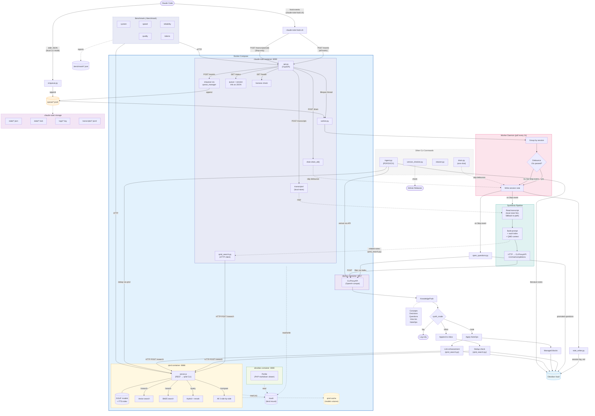

# claude-note Architecture

```mermaid
flowchart TD
    CC(["Claude Code"])

    CC -->|"stdin JSON\n(local CLI mode)"| ENQ["enqueue.py"]
    CC -->|"hook events\n(claude-note-hook.sh)"| HOOKSH["claude-note-hook.sh"]
    HOOKSH -->|"POST /events\n(all hooks)"| API
    HOOKSH -->|"POST /transcripts/{sid}\n(Stop only)"| API

    subgraph docker["Docker Compose"]

        subgraph api_container["claude-note container :8000"]
            API["api.py\n(FastAPI)"]
            API -->|"POST /events"| ENQ2["enqueue via\nqueue_manager"]
            API -->|"POST /transcripts"| TSTORE["transcripts/\n(local store)"]
            API -->|"POST /drain"| DRAIN2["drain.drain_all()"]
            API -->|"GET /status"| STATUS2["queue + session\ninfo as JSON"]
            API -->|"GET /health"| HEALTH2["liveness check"]
            API -->|"lifespan thread"| WORKER
            QMDC["qmd_search.py\n(HTTP client)"]
        end

        subgraph cliproxy_container["cliproxy container :8317"]
            CLIPROXY["CLIProxyAPI\n(OpenAI-compat)"]
        end

        subgraph qmd_container["qmd container :8686"]
            QMDSRV["server.js\n(REST → qmd CLI)"]
            QMDSRV --- QMDIDX[("GGUF models\n+ FTS index")]
            QMDSRV -->|"/vsearch"| VSEARCH["Vector search"]
            QMDSRV -->|"/search"| BM25["BM25 search"]
            QMDSRV -->|"/query"| HYBRID["Hybrid + rerank"]
            QMDSRV -->|"/compare"| CMP["All 3 side-by-side"]
        end

        subgraph obsidian_container["obsidian container :8080"]
            OBS["Perlite\n(PHP markdown viewer)"]
        end

        VAULTDOCKER[("/vault\n(bind mount)")]
        QMDCACHE[("qmd-cache\n(models volume)")]
        api_container -.->|read/write| VAULTDOCKER
        obsidian_container -.->|read| VAULTDOCKER
        qmd_container -.->|"read (ro)"| VAULTDOCKER
        qmd_container -.-> QMDCACHE
    end

    ENQ -->|append| QUEUE[("queue/*.jsonl")]
    ENQ2 -->|append| QUEUE

    subgraph daemon["Worker Daemon (poll every 2s)"]
        WORKER["worker.py"] --> GROUP["Group by session"]
        GROUP --> DEBOUNCE{"Debounce\n15s passed?"}
        DEBOUNCE -->|yes| WRITE
        DEBOUNCE -->|"no, but Stop event"| WRITE["Write session note"]
    end

    QUEUE --> WORKER

    WRITE --> NW["note_writer.py"]
    NW -->|"session log .md"| VAULT

    WRITE -->|"on Stop event"| OQ["open_questions.py"]
    OQ -->|"filter via Haiku"| CLIPROXY
    OQ -->|"promoted questions"| VAULT

    WRITE -->|"on Stop event"| SYNTH

    subgraph SYNTH["Synthesis Pipeline"]
        direction LR
        TR["Read transcript\n(local store first,\nfallback to path)"] --> PROMPT["Build prompt\n+ vault index\n+ QMD context"]
        PROMPT --> CALL["HTTP → CLIProxyAPI\n/v1/chat/completions"]
    end

    TSTORE -.->|"read"| TR

    CALL -->|"POST"| CLIPROXY
    CLIPROXY --> KP["KnowledgePack"]

    PROMPT -.->|"related notes\n(qmd_search.py)"| QMDC
    QMDC -->|"HTTP POST /vsearch"| QMDSRV

    KP -.- concepts["Concepts\nDecisions\nQuestions\nHow-tos\nNoteOps"]

    KP --> MODE{"synth_mode"}
    MODE -->|log| LOG(["Log only"])
    MODE -->|inbox| INBOX["Append to inbox"]
    MODE -->|route| ROUTE["Apply NoteOps"]

    INBOX --> DEDUP["Dedup check\n(qmd_search.py)"]
    ROUTE --> MB["Managed blocks"]
    ROUTE --> LINKS["Link enhancement\n(qmd_search.py)"]

    DEDUP -->|"HTTP POST /vsearch"| QMDSRV
    LINKS -->|"HTTP POST /vsearch"| QMDSRV

    DEDUP --> VAULT[("Obsidian Vault")]
    MB --> VAULT
    LINKS --> VAULT

    subgraph sidecars["Other CLI Commands"]
        direction LR
        DRAIN["drain.py\n(one-shot)"]
        INGEST["ingest.py\n(PDF/DOCX)"]
        CLEAN["cleaner.py"]
        UPDATE["version_checker.py"]
    end

    DRAIN -.->|"skip debounce"| WRITE
    DRAIN2 -.->|"skip debounce"| WRITE
    INGEST -->|"extract via API"| CLIPROXY
    INGEST -->|"dedup via qmd"| QMDSRV
    INGEST -->|"literature notes"| VAULT
    UPDATE -.->|"check"| GH(["GitHub Releases"])

    subgraph bench["Benchmark (./benchmark)"]
        direction LR
        B_SYS["system"] ~~~ B_SPD["speed"] ~~~ B_REL["reliability"]
        B_QUA["quality"] ~~~ B_TOK["tokens"]
    end

    bench -->|"HTTP"| API
    bench -->|"HTTP"| QMDSRV
    bench -.->|"reports"| BREPORT[(".benchmark/*.json")]

    subgraph storage[".claude-note/ storage"]
        direction LR
        S1["state/*.json"] ~~~ S2["state/*.lock"] ~~~ S3["logs/*.log"] ~~~ S4["transcripts/*.jsonl"]
    end

    QUEUE -.-> storage

    style docker fill:#e3f2fd,stroke:#1565C0,stroke-width:2px
    style api_container fill:#e8eaf6,stroke:#3F51B5
    style cliproxy_container fill:#ede7f6,stroke:#673AB7
    style qmd_container fill:#fff8e1,stroke:#F9A825
    style obsidian_container fill:#f1f8e9,stroke:#689F38
    style daemon fill:#fce4ec,stroke:#E91E63
    style SYNTH fill:#e0f2f1,stroke:#009688
    style sidecars fill:#f5f5f5,stroke:#999,stroke-dasharray: 5 5
    style storage fill:#f3e5f5,stroke:#9C27B0,stroke-dasharray: 5 5
    style bench fill:#e8eaf6,stroke:#3949AB,stroke-dasharray: 5 5
    style VAULT fill:#e8f4f8,stroke:#2196F3
    style QUEUE fill:#fff3e0,stroke:#FF9800
    style QMDCACHE fill:#fff8e1,stroke:#F9A825,stroke-dasharray: 5 5
```
