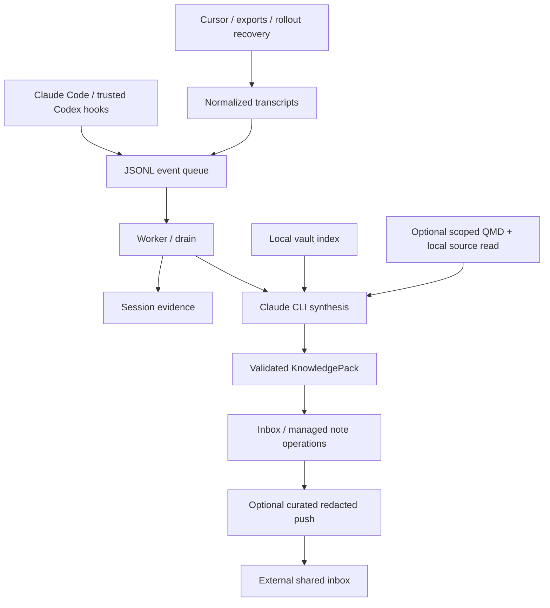

# Implementation architecture

Claude Note captures local assistant work, produces Markdown knowledge, and optionally stages curated notes remotely. [Current system](current-system.md) explains the wider memory architecture and distinguishes external integration patterns.

| Module | Responsibility |
| --- | --- |
| `entry.py`, `cli.py` | CLI dispatch; JSON health works before vault configuration. |
| `enqueue.py`, `queue_manager.py` | Read hook JSON and maintain file-backed events. |
| `importers.py` | Normalize supported local chat/export formats, track content hashes, recover missed sessions. |
| `transcript_reader.py` | Parse user/assistant content and tool outcomes, preserving source identity. |
| `session_tracker.py`, `note_writer.py` | Session state, locks, debounce, and session evidence notes. |
| `worker.py`, `drain.py` | Scheduled and explicit processing. |
| `synthesizer.py` | Build attributed evidence context and invoke installed Claude CLI. |
| `knowledge_pack.py` | Extraction schema and validation. |
| `note_router.py`, `managed_blocks.py` | Typed, vault-confined writes, stable managed updates and inbox entries. |
| `vault_indexer.py`, `qmd_search.py` | Local note metadata and optional collection-scoped retrieval. |
| `ingest.py` | External/internal document extraction, source notes, atomic concepts and candidate merges. |
| `provenance.py`, `push.py`, `health.py` | Producer/author identity, curated sharing, and operational diagnostics. |

## State and identities

`{vault}/.claude-note/queue/` holds daily events; `state/` holds session state, locks, and `vault_index.json`; `logs/` holds worker logs. The local index path is **`state/vault_index.json`**, not the root of `.claude-note/`.

Global application state under `~/.local/share/claude-note/` includes normalized imported transcripts, import hashes, push receipts, and `installed-from.json`. macOS operational logs and heartbeats live under `~/Library/Logs/claude-note/`.

The session identifier is not interchangeable with a conversation title. Imported IDs include source identity so assistants and punctuation variants cannot collide. Content hashes suppress unchanged imports. Author provenance is separate from assistant provenance and neither constitutes approval.

## Trust and failure boundaries

Model note paths must remain inside the resolved vault, including through symlinks. Only supported Markdown operations are applied. Managed blocks preserve surrounding text. Raw session records, source documents, and curated durable lessons have different roles and sharing rules.

QMD failure is optional retrieval degradation; synthesis failure is a failed knowledge-production stage. Inspect logs and JSON health rather than inferring success from a running process or an existing session note. Capture, synthesis, push, and external consolidation each need their own evidence of success.

Synthesis invokes `claude -p`, not a bundled API client. The package has no Python runtime dependencies; the CLI, model service, QMD, and document converters are external tools. Tests use synthetic transcripts and mocked external services.
