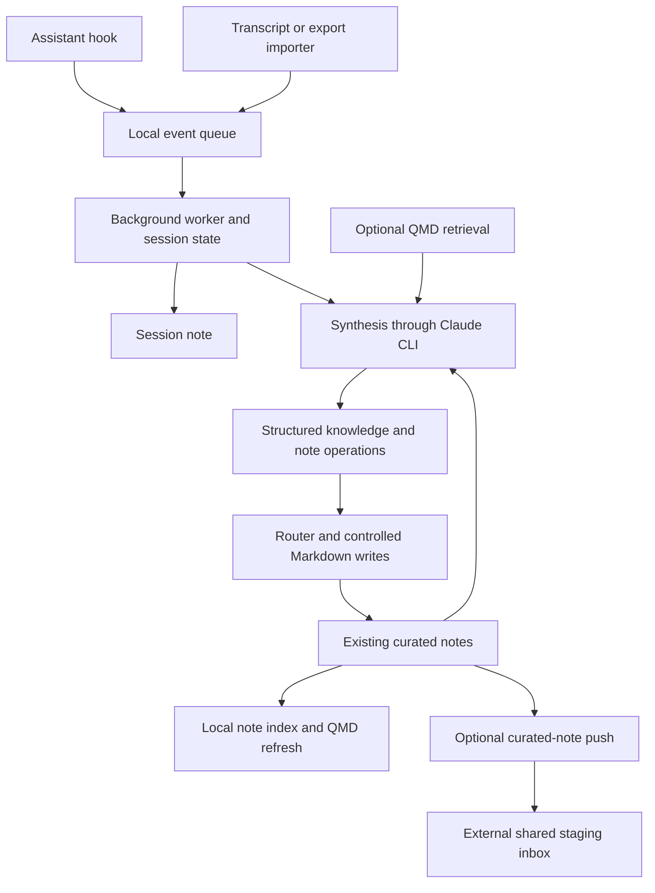

# Memory system reference

This reference describes the architecture behind Claude Note's current development: local capture, curated Markdown knowledge, optional shared memory, and retrieval. It separates features in this repository from lessons learned while operating a larger memory system. Shared database services, task review, tenant synchronization, and consolidation are **integration patterns**, not services bundled with Claude Note.

The reference was reviewed against source on 2026-10-10. Code and tests establish what is implemented; installation files establish what is configured; an exercised workflow establishes what works in a particular installation. An old session note establishes historical context, not present behavior.

## Authorities and derived views

| Layer | Purpose | Authority and boundary |
| --- | --- | --- |
| Assistant transcripts and exports | Evidence of a conversation | Local source material; may contain sensitive text and tool output. |
| Event queue and session state | Recover and coordinate capture | Processing state, not a knowledge base. |
| Session notes | Readable record of work | Local evidence and navigation; not automatically a durable rule or shareable note. |
| Curated Markdown notes | Reusable decisions, patterns, gotchas, references, projects, and literature | The local knowledge surface maintained by people and synthesis. |
| Shared staging inbox | Receive selected, redacted knowledge from a personal vault | Optional upload destination; receipt does not mean integration or approval. |
| Shared canonical memory | Resolve and maintain organizational knowledge | External service owns access control, revision history, and promotion policy. |
| Note index and QMD index | Find relevant material | Rebuildable views of content; never the authority for a fact. |
| Prompt context | A bounded selection for one run | An excerpted view; missing evidence is not evidence of absence. |

An operational observation log and a maintained wiki serve different purposes. A log records what was reported or learned at a time. A wiki integrates that evidence into a usable page. Filling a log with serialized synthesis envelopes does not execute their note operations. Recording a successful worker heartbeat does not create knowledge.

## Local capture and synthesis

Hooks enqueue quickly; the worker does the expensive work later. Importers provide a second route for applications without a usable transcript hook and for sessions a hook missed. Supported formats and capture behavior live in [importers.py](../src/claude_note/importers.py), [transcript_reader.py](../src/claude_note/transcript_reader.py), and the [hook setup guide](hook-setup.md).

The worker can write a session record even when synthesis is disabled or unavailable. Seeing session notes therefore proves capture reached the writer, not that reusable knowledge was extracted. The synthesis mode, model availability, errors, and resulting curated notes must be checked separately. See [worker.py](../src/claude_note/worker.py), [synthesizer.py](../src/claude_note/synthesizer.py), and [synthesis modes](synthesis-modes.md).

Synthesis proposes structured knowledge and note operations. The router and writer control the actual filesystem effects. Managed blocks provide an owned region for updates while preserving surrounding human prose; they are not permission to replace an entire human-authored document. The current local note-operation vocabulary is defined in [knowledge_pack.py](../src/claude_note/knowledge_pack.py), with application in [note_router.py](../src/claude_note/note_router.py) and [managed_blocks.py](../src/claude_note/managed_blocks.py).

## Four different kinds of movement

These operations have distinct success conditions:

| Operation | What moves | What success means |
| --- | --- | --- |
| Personal push | Eligible, redacted curated notes | A destination accepted a staged version. |
| Tenant commit and pull | A tenant's canonical working copy and server revisions | The working copy and remote revision history were reconciled. This is external to Claude Note. |
| Promotion or consolidation | Evidence into maintained shared knowledge | A policy or reviewer accepted a specific change. This is external to Claude Note. |
| Index refresh | Existing content into searchable records and optional vectors | Retrieval can see the current content in the relevant search mode. |

Claude Note's optional push adapter is [push.py](../src/claude_note/push.py). It selects supported note types, respects `share: false` and private directories, excludes session records, skips empty placeholders and unchanged content, redacts recognized secret patterns, and stages selected notes with provenance. It does not publish the entire local vault or perform a shared merge.

Push receipts bind the redacted content hash to the endpoint, organization, uploader identity, and local source vault. Unchanged content sent to a known destination is skipped; selecting a different destination does not inherit that receipt. Older receipts that recorded only a relative path remain unbound and are deferred with a warning. After checking the destination, `claude-note push --resend-legacy` explicitly sends those notes and records new receipts. A dry run never migrates or sends them. Root filenames retain their existing remote paths; nested notes use a separate `_nested/` namespace and a stable source-path hash to prevent flattened-name collisions. Existing unchanged notes are not resent just because the path format changed.

In a shared integration, personal staging and canonical company memory should remain separate. An upload must not silently become an organization-wide rule. A pull must not silently upload unrelated personal notes. Refreshing QMD must not be treated as either action.

## Provenance and current truth

Claude Note records `assistant` and `author` separately. The assistant identifies the producing tool; the author identifies the person whose work is being captured. Neither field alone proves an organization, an access scope, or an approval. Producer identity should come from the adapter rather than model inference. See [provenance.py](../src/claude_note/provenance.py).

Useful shared provenance also includes a stable source identifier, source path, content hash, ingestion time, destination, and resulting revision. Preserve the link to source evidence when appending or consolidating. A polished summary without provenance is difficult to audit or correct.

A current-state view requires more than recency sorting. Explicit supersession, verification time, expiry, and reviewer authority help distinguish a standing decision from an abandoned proposal. External task systems can project accepted facts and maintained concepts first, then show supporting observations. An older note remains evidence of what was believed; it should not win merely because it repeats the query's words.

Session summaries often contain plans. Preserve uncertainty and status words such as proposed, attempted, verified, and superseded. Do not rewrite “evaluate an alternative” as “the alternative is deployed.” Likewise, historical assistant or infrastructure names do not prove those components still run.

## Idempotency and conflict lessons

The repository uses several local protections: processed event IDs, importer content hashes, session state, managed blocks, atomic file replacement, and push content hashes. These mechanisms cover different retry boundaries. None is a blanket exactly-once guarantee for the whole pipeline.

For an external shared merger, production experience supports three independent replay guards:

1. A ledger keyed by destination, stable source identity, and content hash, checked before model work.
2. Local recovery state so an accidentally deleted remote ledger cannot reset all progress.
3. A source marker attached to the applied change, allowing a crash after the write but before the ledger to be recognized on retry.

Retain tombstones or another durable record of processed ledger entries. A generic Markdown sync must not interpret an ignored JSON ledger as a user-requested deletion. Otherwise, a nightly merger can process the same batch forever while appearing successful.

Use optimistic revisions for shared writes. After a concurrent edit, fetch the current document and revalidate the operation before a bounded retry. A lost response is an unknown outcome, not proof the write failed. Deterministic destination paths and an identical-content no-op make recovery safer.

For local/remote content conflicts, preserve the local version as a clearly named conflict copy before accepting the remote revision. Exclude conflict copies from automatic upload and indexing where they would duplicate contradictory knowledge. Report unresolved copies; do not silently overwrite them.

## Scope and security lessons

Local search and a shared API have different trust boundaries. A unified personal QMD index can intentionally search multiple knowledge stores. A tenant worker must search only material its organization and intended audience may access. A broad organization service key is not proof that its caller is the owner of every uploaded note.

An external shared system should enforce these invariants:

- Resolve the destination organization from trusted configuration or an authenticated principal. Do not let a synthesis model choose a broader tenant when uncertain.
- Treat `org`, `team:<id>`, and `person:<id>` as audience sets. Two different teams are not ordered, and a person is not automatically known to belong to a team.
- Allow a merge only when every reader of the target could already read the source. Restricted knowledge must not flow into a wider note, conflict task, ledger, or generated explanation.
- Require explicit ownership mapping for name-based inbox paths. An operating-system username or author email string is metadata, not authorization.
- Enforce scope in database queries and service-role API paths, including semantic retrieval. Filtering only the final UI is insufficient.
- Validate output paths and file types, reject traversal and unsafe links, and keep credentials out of notes and logs.
- Scan selected notes before upload and again before an external merge or model call. Secret-pattern redaction reduces accidental exposure; it does not replace audience controls or classify confidential business information.

Some shared systems mirror identity and operating instructions into a worker workspace. Where the runtime rejects symlinks outside its workspace, copy real files and verify hashes. Keep the organization's identity material tenant scoped, and keep generally shared skills free of private tenant content.

These are integration requirements. Claude Note does not bundle a multi-tenant authorization server, organization-membership database, or shared consolidation worker.

## Retrieval: capability, relevance, and limits

Claude Note's adapter is [qmd_search.py](../src/claude_note/qmd_search.py). The [QMD integration guide](qmd-integration.md) documents setup and commands. An installation must register the intended collections and refresh both text and vectors when it needs both modes.

| Mode | Useful property | Limit |
| --- | --- | --- |
| `qmd search` | Fast BM25 text retrieval without local model inference | Lexical overlap is not semantic relevance; query terms can be conjunctive. |
| `qmd vsearch` | Finds related meaning using embeddings | Requires models and sufficiently current vectors; scores are not calibrated truth probabilities. |
| `qmd query` | Query expansion and reranking | Can trigger large cold model downloads and inference costs. Keep it out of unattended latency-sensitive paths until prepared. |
| Full-document read | Verifies the retrieved evidence | A snippet alone may omit scope, date, caveats, or a later correction. |

`qmd update` refreshes text indexing; `qmd embed` supplies missing or changed vectors. A healthy text index can coexist with stale or absent semantic coverage. Monitor each separately. Collection names are installation-specific; inspect the configured collection before scoping a query. Do not assume one universal name across machines.

For BM25, normalize hyphenated compounds and remove low-information instruction words before querying. If a long conjunctive query returns nothing, reduce terms rather than conclude there is no prior knowledge. Retain topic-bearing nouns. Avoid unbounded retries, and record a failed query separately from a successful zero-result query.

Do not present a BM25 rank artifact as a percentage confidence. A deployed QMD version used `1 / (1 + abs(bm25))`, where stronger negative BM25 values produced **smaller** displayed scores while result order remained correct. That number was also not comparable across queries. Preserve the engine's order and keep thresholds specific to the retrieval mode and version.

An optional relevance judge can filter a BM25 shortlist before prompt injection, but that judge is an external integration pattern. Calibrate its threshold on human-labeled examples, split evaluation by task, and pin the evaluated model version. Measure useful evidence lost as well as irrelevant evidence removed. A floor that works for one corpus or model is not a portable default. A per-note floor also does not prove the whole shortlist is on topic.

Hosted scoring sends the task and candidate excerpts to a provider. It must respect the same data and audience policy as synthesis. Use a wall-clock deadline: a socket inactivity timeout alone can be extended indefinitely by a slowly streaming response. Degraded fallback should be visible in logs or prompt metadata, and credential or quota failures should not trigger repeated calls within one prompt build.

Keep any server-built context pack and local search conceptually distinct. An external task system can prefetch accepted current facts, standing preferences, reviewer corrections, observations, related work, and durable documents. Local QMD remains an additive cue. Neither should silently override an explicit standing preference or a newer verified decision.

## Configured, exercised, and healthy

Use three separate claims when reporting installation status:

| Claim | Required evidence |
| --- | --- |
| Implemented | Source and focused tests cover the behavior. |
| Configured | Hook files, executable paths, credentials where required, and service definitions exist. |
| Exercised | A real or controlled event reached the queue, worker, output, and relevant downstream stage. |

A hook file's presence does not prove the host trusted or executed it. An importer may recover a missed session, which proves importer coverage rather than hook delivery. A running worker does not prove synthesis succeeded. A successful upload does not prove the shared merger advanced.

[health.py](../src/claude_note/health.py) powers `claude-note status --json` with bounded local probes, service state, capture configuration, push and import freshness, note counts, and synthesis diagnostics. It is an integration surface for setup tools, not a substitute for an end-to-end probe.

Unattended stages need bounded work, noninteractive execution, a single active writer where necessary, and success heartbeats. Monitor missing or stale heartbeats from outside the job itself. Keep logs compact. Report backlog, failed items, and actual new knowledge separately: resolving duplicates or repeatedly retrying a stuck batch is not the same as learning something new.

An external merger should cap model calls and run time, process cheap deterministic resolutions outside the model budget, and park repeatedly invalid items visibly. A night when every model backend is unavailable should not permanently penalize all waiting notes. Dry runs should remain free of writes, including misleading success heartbeats.

## How the design evolved

| Earlier assumption | Current approach | Status in this repository |
| --- | --- | --- |
| One assistant and one hook source | Multiple transcript/import adapters with producer provenance | Implemented through capture and provenance modules. |
| A session summary is the knowledge base | Separate session evidence from curated typed notes | Implemented through synthesis modes, routing, and push selection. |
| Model output can directly rewrite the vault | Structured operations with controlled writer behavior and managed blocks | Implemented locally; external servers need their own validators. |
| Every note should be synchronized | Explicit curated sharing, local privacy controls, and redaction | Optional push adapter; remote authorization is external. |
| A staged upload is canonical shared knowledge | Separate staging, revision sync, promotion, and consolidation | Shared integration design; canonical services are external. |
| Search scores are confidence | Preserve mode-specific semantics and verify source documents | Retrieval adapter and documented operating rule. |
| Text reindexing keeps semantic search healthy | Refresh and monitor text and vector coverage separately | QMD operator responsibility; not an automatic global guarantee. |
| A service installed means capture works | Distinguish configured, exercised, and healthy | Local health report plus end-to-end verification. |
| More memory in the prompt is always better | Bounded retrieval, explicit uncertainty, current-state priority, and measured relevance | Local retrieval is optional; advanced context packs and judges are external. |

## Source map

The implementation references above are public, inspectable repository modules. Broader sync, current-state, scope, consolidation, and evaluation guidance is a sanitized synthesis of internal operating experience. It describes reusable contracts, not private infrastructure or a promise that those services ship with Claude Note.

For operational details, start with [getting started](getting-started.md), [configuration](configuration.md), [hook setup](hook-setup.md), [service setup](service-setup.md), [QMD integration](qmd-integration.md), and [troubleshooting](troubleshooting.md). Prefer current source and tests when an older note or guide disagrees.
