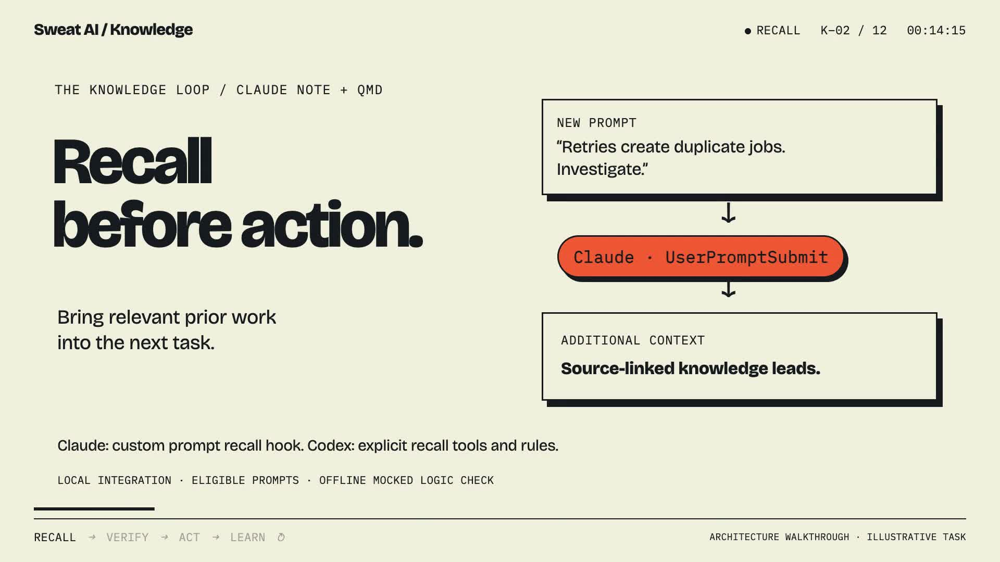

# Remember. Then act.

A 112-second knowledge-system walkthrough for technical builders, produced on 10 October 2026. The film uses kinetic typography, an original instrumental score, and captions to explain how a lesson becomes useful in the next task.

[](assets/knowledge-loop.mp4)

[Watch or download MP4](assets/knowledge-loop.mp4) · [WebVTT captions](assets/knowledge-loop.vtt) · [Media and evidence manifest](examples/knowledge-loop/media-manifest.json)

The retry scenario and displayed records are synthetic. The film was produced against [PR #8](https://github.com/crimeacs/claude-note/pull/8) at commit `e80fb97ffd782ebf82d67b83000ef92e39ceed1b`, while that change was under review. Its on-screen “proposed” labels describe that historical snapshot. Current source and Git history establish what has since been integrated.

## The loop

1. A task arrives. Search relevant, allowed knowledge before repeating work.
2. Recall returns source-linked leads. Read the full source and check its date, scope, status, and corrections.
3. Compare the lesson with current code. Apply a change and test the behavior.
4. Capture the conversation and tool outcomes as evidence.
5. Extract a typed, source-backed lesson. Preserve corrections and human-authored context.
6. Refresh retrieval so a later task can find the updated knowledge.

The film also distinguishes local notes, optional shared staging, canonical shared memory, and derived indexes. Uploading a note does not approve it as an organization-wide rule. See the [system reference](current-system.md) for those integration boundaries.

## Recall before action

Use this operating rule in an agent's project instructions:

> Before relying on prior knowledge or making a change that may repeat earlier work, search the intended, authorized knowledge collection using a few content-bearing terms. Open relevant full sources; check their scope, date, verification, and superseding corrections against the current task and code. Treat snippets as leads. If search misses, reduce terms or use a prepared semantic search; distinguish a failed lookup from no results. Act on verified evidence, test the result, and write durable corrections back as typed notes with source links. Refresh the indexes needed for the next session.

This is an operating instruction. It does not itself enforce agent compliance.

For an installation with a `notes` collection, an illustrative search and full read are:

```bash
qmd search "retry duplicate" -c notes -n 5 --json
# Open a URI returned by that search, for example:
qmd get "qmd://notes/retry-idempotency.md"
```

Collection names and note URIs depend on the installation. The film's `demo` collection is illustrative. Do not search across a tenant or audience boundary just because a personal machine has a unified index. After changing notes, `qmd update` refreshes text search; `qmd embed` refreshes vectors when semantic retrieval is needed. These are separate from `claude-note index`. See [QMD setup](qmd-integration.md).

## What the hooks actually do

| Path | Behavior | Verification needed |
| --- | --- | --- |
| Bundled Claude Code hooks | Enqueue capture events for background processing. | Controlled event reaches queue, worker, and output. |
| Bundled Codex hooks | Enqueue capture events where the host supports and trusts them. | Verify delivery separately from rollout recovery. |
| Claude Note's QMD adapter | Retrieve existing notes for synthesis and linking. | Check configured collection, source reads, and bounded queries. |
| Custom Claude prompt recall | An external `UserPromptSubmit` integration can return source-linked leads in `additionalContext`. | Exercise the integration in its host; a mock does not prove delivery. |
| Explicit agent recall | Search, read sources, and verify under project instructions, including in Codex. | Inspect tool use and the evidence supporting the change. |

The custom prompt hook and shared context-pack services shown in the film are external integrations. Claude Note does not install them. Prompt context can ask an agent to verify sources and write back a lesson; it cannot establish that either action happened. Hooks may skip prompts or time out, so an agent should still perform explicit recall when the task calls for it. See [hook setup and verification](hook-setup.md).

## Inspect the evidence

The [executable retry example](examples/knowledge-loop/retry-example.py) uses only Python's standard library and an in-memory SQLite database. Run it from the repository root:

```bash
python3 docs/examples/knowledge-loop/retry-example.py
```

Compare its output with the [recorded result](examples/knowledge-loop/retry-result.json). The first insert commits before its response is deliberately lost. A retry with a fresh key stores two rows. Reusing one operation key with a unique constraint and an upsert keeps one row and returns the existing job. The [typed gotcha](examples/knowledge-loop/gotcha-note.md) records that correction and its limits. This proves one controlled boundary; it is not an exactly-once guarantee for an entire system.

The [archived recall receipt](examples/knowledge-loop/recall-probe.json) records eight passing assertions from an offline probe of a custom Claude prompt hook. Retrieval and related lookups were mocked, external processes and network were blocked, and credentials and private notes were not read. It verifies the source-linked context shape and instructions to read sources and write back lessons. It does not measure real retrieval quality, latency, or assistant-event delivery. Its personal unified-index query trace is historical evidence, not a tenant-scoped installation recipe; the custom hook source is not bundled here.

The [media manifest](examples/knowledge-loop/media-manifest.json) binds the delivered video, captions, poster, and teaching evidence with SHA-256 hashes. The MP4 is 1920 × 1080 at 30 fps with H.264 video and stereo AAC audio. It passed full decode, end-to-end playback review, and checks for extended black frames and silence. Repository validation covers code separately from these media checks.

## From repository to installation

Merging updates repository source. It does not reinstall a worker, change a host's trusted hooks, deploy shared services, or publish a release. Follow the [checkout update steps](../README.md#update-an-existing-installation), verify the recorded source commit, and exercise the intended capture path. Test any external recall integration separately.
